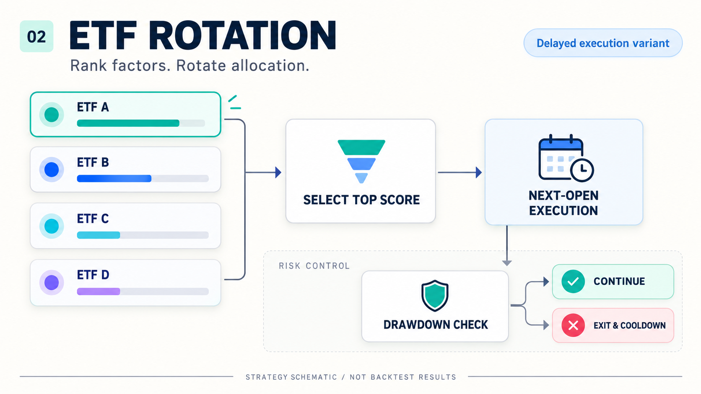

# ETF Factor Rotation Strategy

**Factor ranking · Reallocation on target changes · Next-open execution and drawdown controls**



The original strategies select the ETF with the highest daily factor score. The local entry point accepts market prices
and precomputed scores and reuses the original full-allocation strategies, portfolio, and delayed engine.
It does not reconstruct the missing factor formulas.

| Variant | Allocation and signal | Supported execution |
| :--- | :--- | :--- |
| `plain` | Highest-score ETF; no rebalance when the target is unchanged | Verified `delayed` path |
| `quantile` | Historical drawdown quantile, consecutive breaches, and cooldown | Verified `delayed` path |
| `absolute` | Absolute drawdown threshold, consecutive breaches, and cooldown | Verified `delayed` path |

`delayed` executes the previous signal at the next opening price. The original immediate full-allocation engine and current
full-allocation strategies use incompatible signal formats. The local entry point exposes only the verified delayed path;
the original immediate and fixed-quantity files remain available. The teaser illustrates delayed execution.

## Quick start

```bash
python -m pip install -r requirements.txt
python -m local.run --demo --output runs/demo_rotation
python -m local.run --prices /path/to/prices.csv --factors /path/to/factors.csv --output runs/real_rotation
```

The demonstration uses synthetic prices and arbitrary scores, **not a historical backtest of the original factors**.
The supplied archive lacks `data.indicators`, `data.data_loader`, `data.indicator_xhs`, and market-data files.
Reproducing the original notebooks requires those modules and data, or existing precomputed factor tables for the new entry point.

## Original research

- [Single-strategy notebook](ETF轮动/backtest.ipynb)
- [Factor-comparison notebook](ETF轮动/backtest2.ipynb)
- [Data-preparation notebook](ETF轮动/data_processing.ipynb)
- [English research document](ETF轮动/ETF_Rotation_Research_EN.docx)

The local entry point follows the notebook's numerical costs: ETF commission `0.00005` (0.005%) and relative slippage
`0.0005` (0.05%). The original README contains inconsistent percentages and written units.

## Explore and reproduce

| File | Purpose |
| :--- | :--- |
| [Quickstart.ipynb](Quickstart.ipynb) | Guided entry point; original research notebooks remain available |
| [PROJECT_OVERVIEW.html](PROJECT_OVERVIEW.html) | Offline project overview, opened directly in a browser |
| [docs/REPRODUCE.md](docs/REPRODUCE.md) | Environment setup, data schema, commands, and outputs |
| [docs/IMPLEMENTATION_NOTES.md](docs/IMPLEMENTATION_NOTES.md) | Actual code behavior, documentation discrepancies, and boundaries |
| [docs/VALIDATION.md](docs/VALIDATION.md) | Completed checks and unverified items |
| [docs/ORIGINAL_README.md](docs/ORIGINAL_README.md) | Archived original README, including previously reported results |
| [CHANGELOG.md](CHANGELOG.md) | Scope of changes |

Each run writes daily equity, trades, parameter and data fingerprints, a log, and a table-only HTML report to `runs/`.
Nonempty output directories are never overwritten. Choose a new `--output` for each run.

## Preserve the strategy

The strategy calculations, parameters, data fields, and identifiers are preserved. Comments, docstrings, and reader-facing logs are translated. Exact original sources are retained in `archive/originals/`.
New entry points live in `local/`: no parameter optimization, additional trading rules, or changes to exercise or rollover logic.
Original notebook calculations and execution counts are retained. Comments, descriptive strings, and displayed output labels are translated; programmatic fields remain intact. English navigation is added at the top.
English research documents and market-data files are retained as source materials.

`docs/original_manifest.json` records original file hashes and retained locations. Run
`python -m local.verify_originals` to verify original archive bytes, unchanged data, and translated executable semantics.

The teaser is a user-approved strategy schematic, not a backtest result. Synthetic fixtures are selected only with an explicit `--demo`.
Previously reported results, synthetic demonstrations, and user-data runs are labeled separately.
